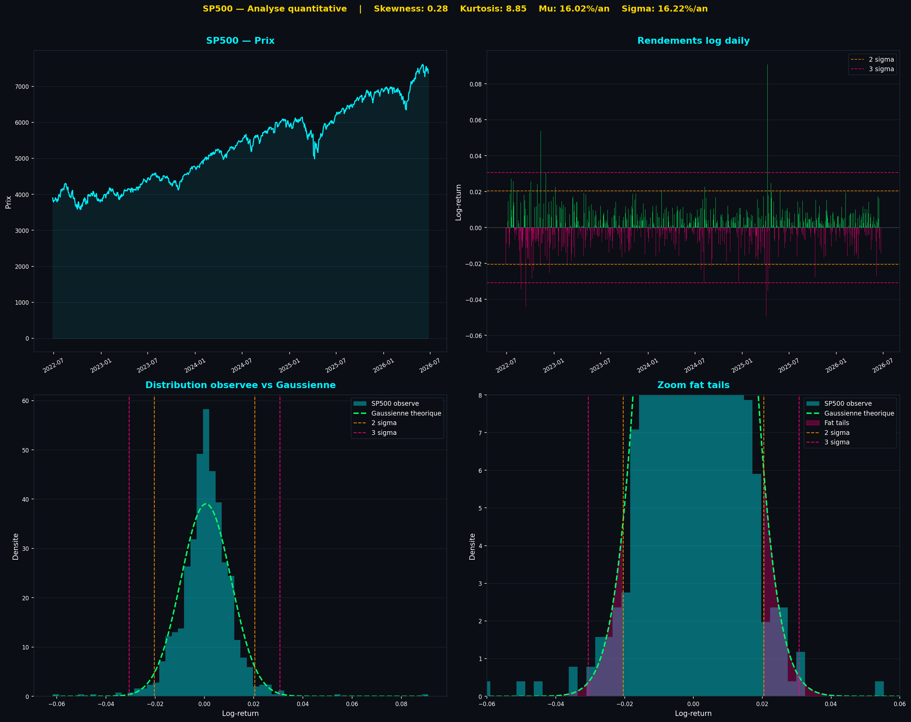
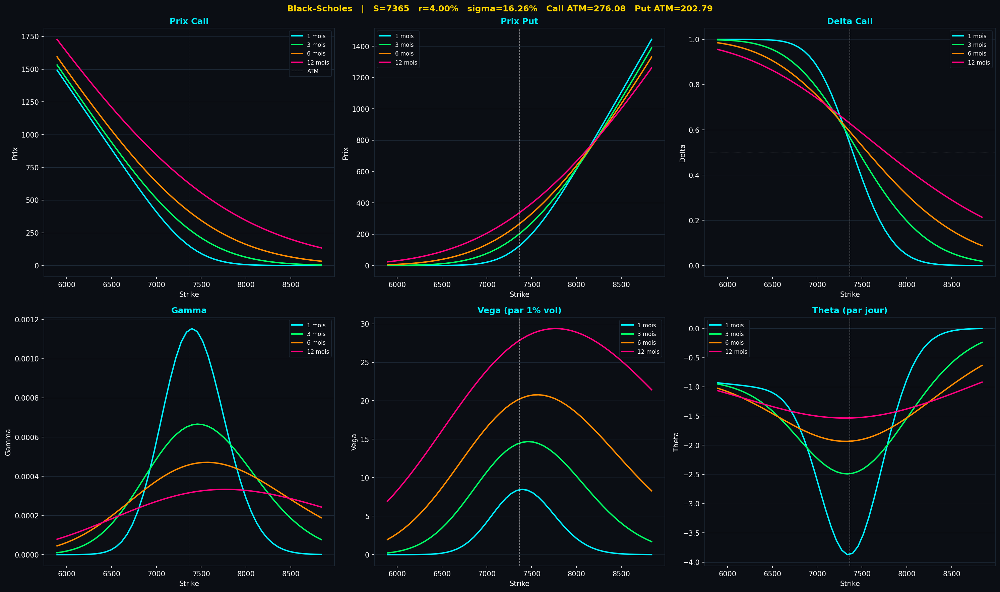
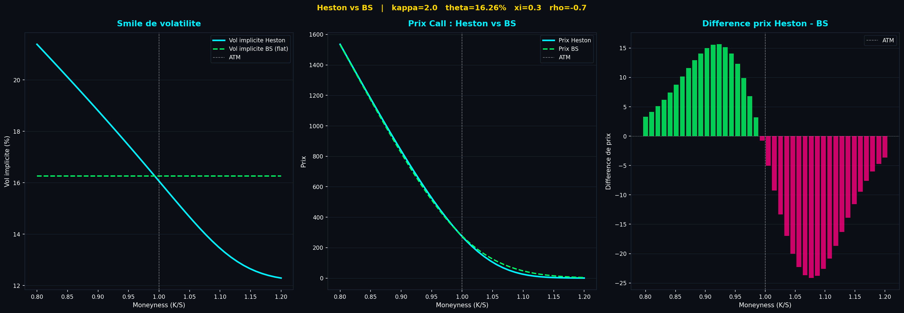
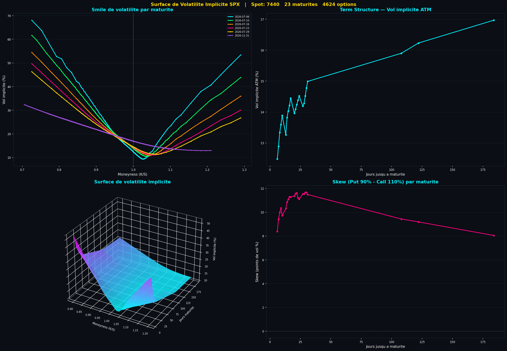

# SP500 Quant Research — De l'empirique au pricing avancé

Projet personnel de recherche quantitative construit de zéro en Python, partant des données brutes du SP500 jusqu'à la construction d'une surface de volatilité implicite calibrée sur de vraies cotations d'options. L'objectif : démontrer une compréhension de premier principe des concepts de finance de marché, pas seulement leur application.

## Approche

Chaque module part d'une question théorique et la confronte aux données réelles. Les calculs sont volontairement écrits de façon explicite (boucles, formules détaillées) plutôt qu'avec des fonctions pandas/numpy raccourcies, pour garantir une compréhension complète de chaque étape — du calcul d'un rendement jusqu'à l'inversion numérique de Black-Scholes.

## Structure du projet

```
quant-research-sp500/
│
├── data/
│   ├── SP500_clean.csv          # Prix daily SP500, 2022-2026
│   ├── VIX.csv                  # Vol implicite ATM 30j, même période
│   └── spx_options_clean.csv    # Cotations réelles CBOE, 25 maturités
│
├── 01_rendements.py             # Rendements arithmétiques vs logarithmiques
├── 02_distribution.py           # Skewness, kurtosis, fat tails vs gaussienne
├── 03_drawdown_ratios.py        # Drawdown, Sharpe, Sortino, Calmar
├── 04_monte_carlo.py            # Simulation GBM sous mesure réelle
├── 05_black_scholes.py          # Pricing, Greeks, parité call-put
├── 06_heston.py                 # Vol stochastique, smile théorique
├── 07_variance_risk_premium.py  # Backtest short vol systématique
├── 08_long_straddle_hedge.py    # Simulation delta-hedge, P&L gamma/theta
└── 09_vol_surface.py            # Surface de vol réelle (données CBOE)
```

## Modules

### 1 — Rendements et CAGR
Calcul des rendements arithmétiques et logarithmiques, vérification empirique de la relation d'Itô :

```
ln(S_T/S_0) / T = μ_log
CAGR_théorique = μ_log − σ²/2
```

Mise en évidence du *vol drag* — l'écart entre rendement arithmétique annualisé et rendement géométrique réellement empoché par l'investisseur.

### 2 — Distribution des rendements
Calcul du skewness et du kurtosis (formules non biaisées, N−1). Comparaison du nombre d'événements à 2σ et 3σ observés vs prédits par une gaussienne — sur la période étudiée, les chocs à 3σ sont environ **3x plus fréquents** que ne le prédit un modèle gaussien.



### 3 — Risque
VaR historique et paramétrique, CVaR (Expected Shortfall), maximum drawdown, ratios Sharpe / Sortino / Calmar.

### 4 — Monte Carlo
Simulation de 1000 trajectoires par mouvement brownien géométrique, calibrées sur μ et σ empiriques, comparées à la trajectoire réelle.

### 5 — Black-Scholes
Pricing complet call/put, calcul analytique des Greeks (delta, gamma, vega, theta, rho), vérification de la parité call-put.



### 6 — Heston
Implémentation du modèle à volatilité stochastique via intégration de la fonction caractéristique. Génération d'un smile de volatilité théorique et comparaison avec la vol plate de Black-Scholes — mise en évidence du skew induit par la corrélation négative prix/volatilité (ρ < 0).



### 7 — Variance Risk Premium
Backtest d'une stratégie systématique de vente de straddle ATM, delta-hedgée, sur 48 mois. Résultat : **win rate de 87.5%**, vol implicite moyenne (VIX) de 18.28% contre vol réalisée moyenne de 14.74% — confirmation empirique de la prime de risque de variance.

### 8 — Long Straddle Delta-Hedgé
Simulation symétrique au module 7 : achat de straddle, delta-hedge quotidien, décomposition du P&L en composante gamma et composante theta. Démonstration numérique que le P&L journalier est piloté par le carré du mouvement du sous-jacent (½ × Γ × dS²), avec identification des clusters de jours gagnants correspondant à des épisodes réels de stress de marché.

### 9 — Surface de volatilité implicite
Construction d'une surface de volatilité à partir de vraies cotations d'options SPX (CBOE, 25 maturités, plusieurs milliers de strikes). Mise en évidence :
- du smile par maturité, avec aplatissement progressif aux maturités longues (cohérent avec la prédiction théorique du modèle Heston)
- de la term structure de la vol ATM
- du skew systématiquement positif (puts OTM plus chers que calls OTM), signature de l'aversion au risque de queue du marché



## Concepts démontrés

- Lemme d'Itô et relation μ − σ²/2
- Rendements log vs arithmétiques, et leurs propriétés d'additivité
- Fat tails, asymétrie et excès de kurtosis
- VaR / CVaR historique et paramétrique
- Mesure réelle P vs mesure risque-neutre Q
- Pricing d'options et sensibilités (Greeks)
- Volatilité stochastique et smile de volatilité
- P&L de gamma trading et variance risk premium
- Construction d'une surface de volatilité à partir de données de marché réelles

## Limites et axes d'amélioration

- Les stratégies de vente/achat de straddle sont simulées sans frais de transaction ni spread bid-ask — un calcul de P&L net intégrant ces coûts serait nécessaire avant toute conclusion sur la viabilité opérationnelle
- La surface de volatilité est un instantané unique (30 juin 2026) ; un historique de surface permettrait d'étudier la dynamique du skew dans le temps
- Heston n'est pas calibré sur les données de marché réelles du module 9 — une calibration par optimisation (moindres carrés sur les prix observés) serait l'étape naturelle suivante

## Auteur

Thomas Estop
